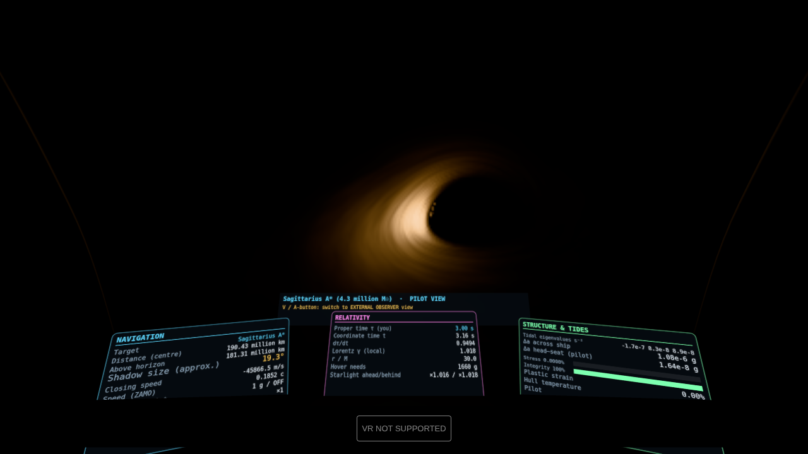
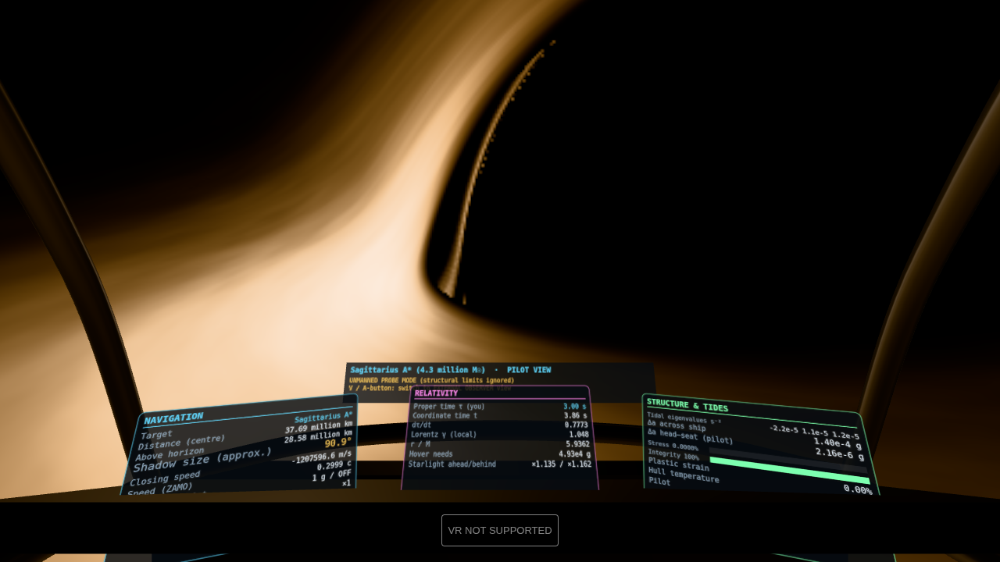
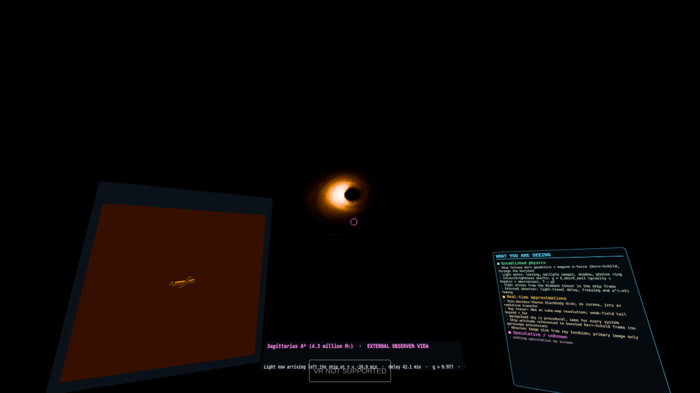
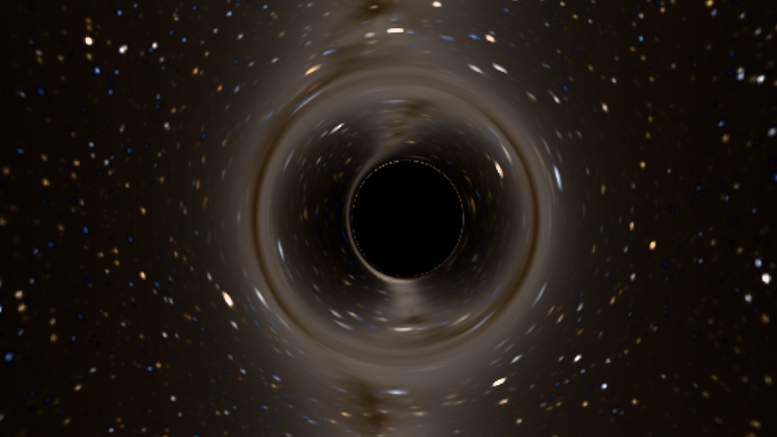
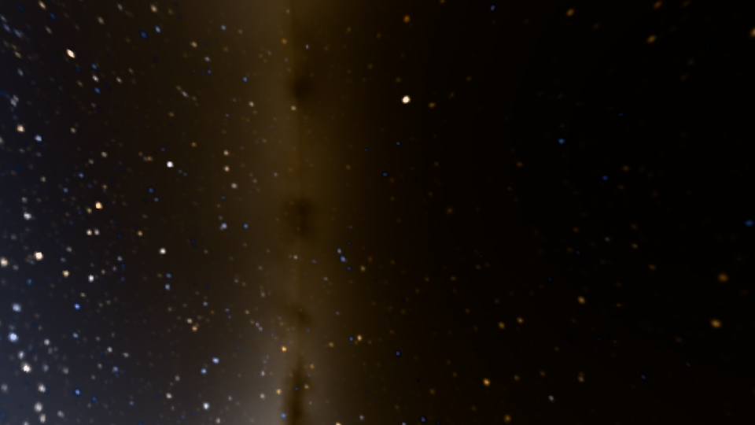
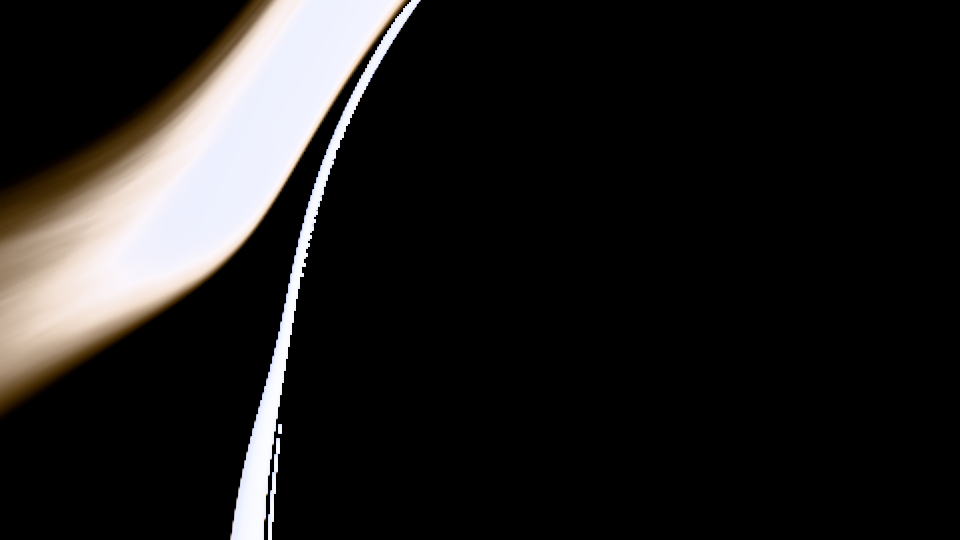
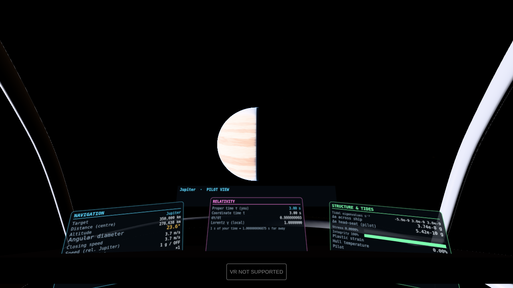
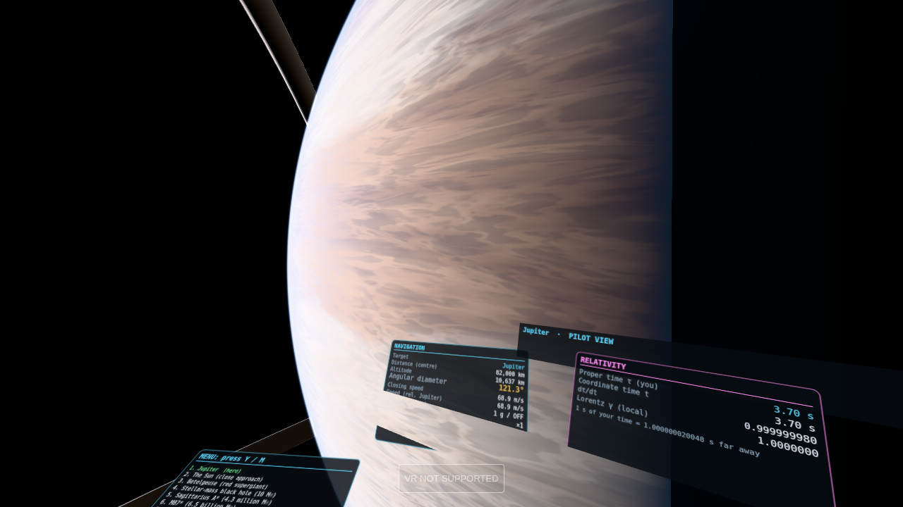
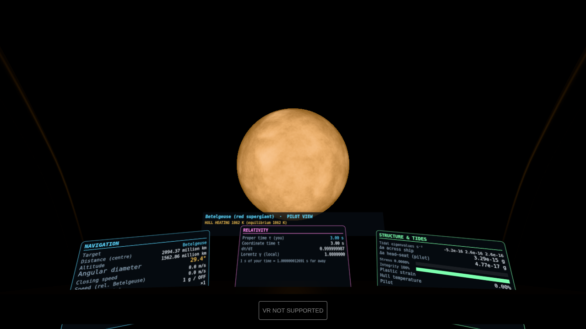
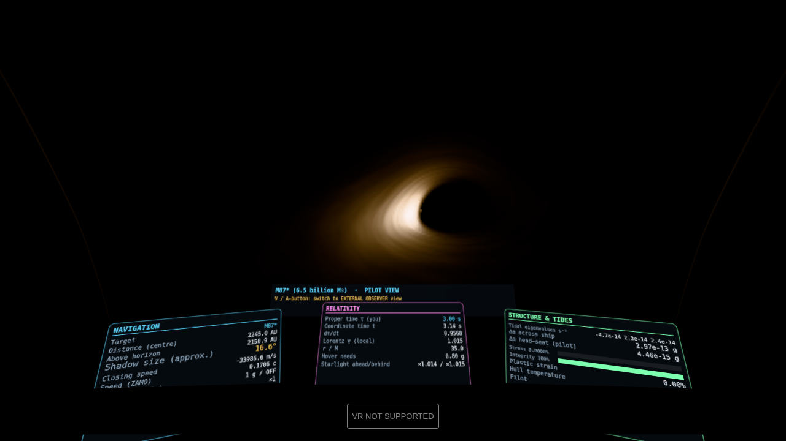

# LIGHTCONE

**A relativistic VR space-flight simulator at true astronomical scale, built on WebXR.**

Fly a ship through spacetime that obeys general relativity. Watch Jupiter grow until its
limb swallows your field of view. Skim a star whose surface cells are the size of
countries. Then fall into a black hole. Your ship's motion, what you see, the tides tearing
at the hull, and the light a distant observer receives are all computed from the Kerr
metric, not animated.

> **Scope note.** This repository implements the *graphics, scale, physics and black-hole*
> requirements in full. The prompt said to "keep everything already in the prompt", but the
> original base game prompt was not included in the request, so its other requirements are
> not implemented. WebXR (three.js + TypeScript) was chosen because it runs on standalone
> headsets (Quest browser) and PC VR without an install, and because it can be built and
> tested here. If the base prompt specified another engine, the physics core
> (`src/physics/`) and the GLSL tracer are self-contained and portable.

## Gallery

| | |
|---|---|
|  Arrival at Sgr A* |  6 M from Sgr A*: the disk fills 90° of sky |
|  **External observer view** with tracking telescope |  Lensed Milky Way and shadow (disk off) |
|  Inside the horizon, looking out: the screen does not go black |  Inside the horizon, looking toward the hole |
|  Jupiter from 350,000 km |  10,600 km above Jupiter's clouds: 121° across |
|  Betelgeuse from 14 AU |  M87* |

*(Captured headlessly with a software renderer at reduced quality; a real GPU renders sharper.)*

## Running it

```bash
npm install
npm run dev          # http://localhost:5173  (desktop: mouse + keyboard)
npm test             # 27 physics/photometry validation tests
npm run build        # static site in dist/
```

**VR:** WebXR requires a secure context. Either:
* deploy `dist/` to any HTTPS static host (e.g. GitHub Pages) and open it in the headset
  browser, or
* for a Quest over USB, run `adb reverse tcp:5173 tcp:5173` and open
  `http://localhost:5173` in the Quest browser.

Then press **ENTER VR**. Quality steps down automatically to hold the headset's frame rate.
`?quality=low|medium|high|ultra` sets a starting level.

## Destinations

| # | Destination | What to try |
|---|---|---|
| 1 | **Jupiter** (+ Io, Europa, Ganymede, Callisto) | Thrust in and watch the limb consume the sky. Find Io's shadow. Dip into the atmosphere: drag, heating, pressure. |
| 2 | **The Sun** (0.1 AU) | Granulation resolves as you close in. Watch the hull temperature. |
| 3 | **Betelgeuse** | ~764 R☉. Its surface would lie beyond the asteroid belt. |
| 4 | **10 M☉ black hole** | Tides kill the pilot ~1,500 km out and break the ship ~850 km out. Press **P** to continue as an unmanned probe. |
| 5 | **Sagittarius A\*** | Cross the horizon intact; the tides only win much deeper, and the run ends at the inner horizon. |
| 6 | **M87\*** | A horizon wider than Pluto's orbit. One ISCO orbit takes days; use time warp. |
| 7 | **TON 618-class** | Hovering 10 M out needs only about 1 g. |

Jumping between systems is a labelled, non-physical gameplay convenience. Everything after
arrival is simulated.

## Two views of one fall

* **Pilot view:** the first-person experience. The sky is ray-traced from your own 4-velocity
  and position every frame, including inside the event horizon, where you still see the
  universe outside.
* **EXTERNAL OBSERVER view** (`V`, or **A** in VR): a static observer far away, with its own
  ray-traced sky and a tracking telescope. It shows only the light that has actually reached
  it. As you fall in, your image lags, slows, freezes at the horizon, reddens, and dims
  exponentially at the rate set by the horizon's surface gravity. It never shows you
  crossing. Its clock and its pictures differ from the pilot's because they are different
  observations of the same worldline.
* **Dual view** (`B`, desktop only, off by default): both at once, for teaching.

## Controls

In VR a welcome screen explains the controls. Point either controller at any panel and
pull the trigger to click. Press **Y** (or the **☰ MENU** button on the left console) for
the destination menu, view switch, time warp, engine power, disk and quality. Floating
labels name what you are looking at and how far away it is.

| | Desktop | VR (Touch / xr-standard) |
|---|---|---|
| Main engine / retro | W / S | right trigger / left trigger |
| Translate | A D (strafe), R F or Space Ctrl (up/down) | left stick |
| Pitch / yaw | arrow keys | right stick |
| Roll | Q / E | grips |
| Look around | drag the mouse | your head |
| Engine power (0.1–30 g) | `[` `]` | menu |
| Time warp (×1 … ×10⁸) | `,` `.` | X / B |
| Pilot ⇄ external observer | V | A |
| Station-keep (hold ZAMO / match target) | H | left-stick click |
| Point at target / next target | G / T | right-stick click |
| Menu (destinations, options) | M, or click ☰ MENU | Y, or point at ☰ MENU |
| Disk on/off · unmanned probe · reset | K · P · Backspace | menu |

## What makes the scale feel real

* **True sizes, true distances, true angular sizes.** Analytic ray-cast bodies keep the limb
  exact whether a planet is a dot or fills 120° of view.
* **Physical photometry everywhere.** Planck × CIE in cd/m², from the 2×10⁹ cd/m² Sun to
  10⁻³ cd/m² starlight. A foveal plus wide-field eye-adaptation model and CIE glare replace
  arbitrary bloom.
* **Near-field references.** Cockpit struts, the dashboard and the deformable hull are lit by
  the actual light field (starlight, planet-shine, lensed disk light).
* **Motion from physics.** Speeds and timescales are real, with time warp.
* **No shake, no fake fog.** Awe comes from geometry and light.

## Physics, approximations, and what is speculative

The cockpit panel **"What you are seeing"** classifies everything on screen live as
*established GR / real-time approximation / speculative*. Full details, formulas and
validation are in **[docs/PHYSICS.md](docs/PHYSICS.md)**. The review of existing renderers
and their licences (Bruneton BSD, Odyssey GPL, NASA SVS references, and others) is in
**[docs/RESEARCH.md](docs/RESEARCH.md)**.

## Code map

```
src/physics/   kerr.ts (metric, Hamiltonian geodesics) · frames.ts (tetrads) · tidal.ts (Riemann)
               disk.ts (Novikov–Thorne) · shipKerr.ts · observer.ts (retarded-image solver)
               structure.ts (stress, damage, crew) · constants.ts
src/render/    kerrTracer.ts (GPU Kerr ray tracer) · bodies.ts (true-scale stars/planets)
               blackbody.ts (Planck×CIE LUT) · skyGen.ts (procedural photometric sky)
               exposure.ts (eye adaptation) · cockpit.ts · shipModel.ts · *View.ts
src/world/     systems.ts (destinations) · newtonianWorld.ts · kerrWorld.ts · telemetry.ts
src/ui, src/input, src/app.ts
tests/         physics + photometry validation (vitest)
dev/           standalone tracer harness for headless checks
```

## Licence

MIT. See [LICENSE](LICENSE). No third-party code is vendored; three.js is an npm dependency (MIT).
