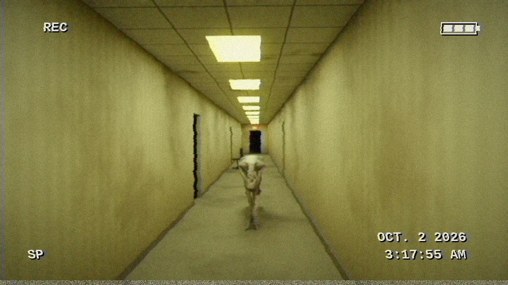
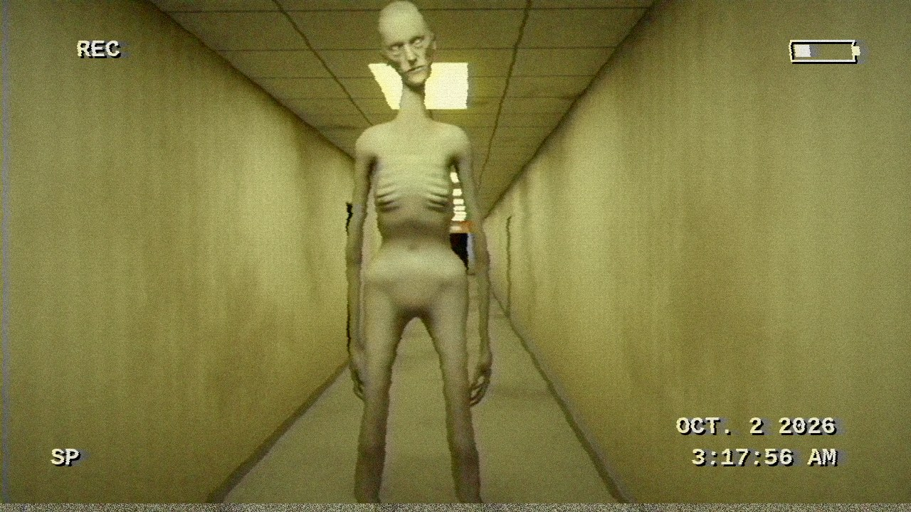
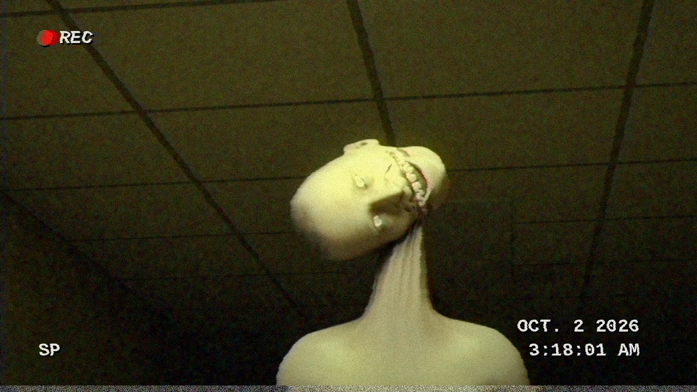
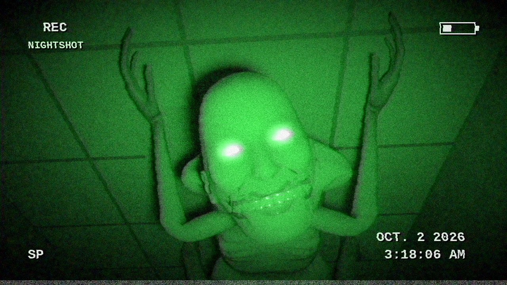

# THE HALLWAY

> *Recovered camcorder tape. OCT. 2 2026, 3:17 AM.*

**▶ [`the_hallway.mp4`](the_hallway.mp4)** · 30 seconds · sound on · lights off

A 30-second found-footage horror short, rendered in Blender (Cycles), scored
from bent CC0 recordings, and degraded into a dying camcorder tape, all from
Python.

| | |
|---|---|
|  |  |
|  |  |
|  | |

## What happens (spoilers)

1. An empty, yellow, humming office corridor. One tube at the far end sputters.
2. When it comes back on, something pale is standing under the EXIT sign, up on its toes.
3. Every time the lights cut out, you hear it run. When they come back it is closer, and
   standing perfectly still: folded in half with its face craned up at you; reaching for
   the lens; scuttling head-first and upside down on its hands and feet.
4. It stops two metres away. The hum stops with it. It smiles, and keeps smiling past where
   a mouth should stop, while its neck goes over one cracking notch at a time and the
   lights behind it die, one breaker at a time.
5. Blackout. The camcorder flips to NIGHTSHOT. The hallway is empty. Something sniffs.
6. The operator looks up.
7. *TAPE 1 OF 7 RECOVERED. THE OTHER SIX ARE STILL RECORDING.*

## The Tenant

The thing in the hallway is a **real human body made wrong**, not a monster.

- **Base**: MakeHuman's hm08 mesh (via MPFB), with its skeleton and skin weights. The macro
  morphs are pushed to *very old, starved, too tall*, then individual targets are
  extrapolated past their limits: neck 1.6x, forearms 2x, fingers 2.2x, mouth 2.2x wide,
  eyes bigger and further apart, cheeks hollowed.
- **A skeleton under the skin**: the body is subdivided, then `creature.starve()` sculpts
  ribs (with the gaps between them sucked in), collarbones and the hollows above them, a
  caved-in belly, jutting hip bones and a ridge of vertebrae, all placed from the rig's
  own joint positions.
- **Skin**: a photographic old-skin texture drained to a jaundiced corpse-pale, with livor
  mottling, veins, bruised sockets, bloodless lips, AO grime in every crease, and
  hands and feet that darken toward the fingertips where the blood has stopped.
- **Eyes**: real iris photos re-mapped in code into a cataract grey with pinprick pupils
  and yellowed, bloodshot whites. Each eyeball has a Damped Track on the camera. It never
  blinks and never looks away.
- **The smile**: MakeHuman's FACS-style expression units (corner puller, upper and
  lower lip retraction, platysma) stacked over the too-wide mouth. The teeth are bared
  and the neck tendons strain, while the eyes take no part in it. Baked to shape keys:
  blank → grin → *wider*, plus a scream for the end.
- **Poses** are built by aiming bones at world directions: a marionette on tiptoe,
  folded double, reaching, an Exorcist spider-walk, looming, and splayed on the ceiling.

## The sound

Recorded CC0 foley, stretched, dropped and convolved with Rubber Band, filters and
synthetic impulse responses, plus synthesis for the electrical hum:

- **Fluorescents**: 120 Hz ballast harmonics plus mains-modulated arc sizzle that follows
  every tube, relay ticks, arcing, ballast pings, breakers dropping out in the walls.
- **It, moving in the dark**: too-fast bare footfalls on carpet, further down the hall
  each time, hands and nails when it crawls, stopping dead the instant the lights return.
- **It**: real bone breaks for every notch its neck goes over, wet lips peeling back,
  a death-rattle croak (slowed creature vocals over a synthetic glottal fry), a sniff
  right above the microphone, its breath, and a layered, crushed scream.
- **The operator**: their heartbeat speeding up, their breathing, the breath they hold,
  the gasp they can't.

## Files

| file | does |
|---|---|
| `timeline.py` | Single source of truth: every flicker, blackout, crack and clunk, by frame. Picture, sound and post all read it. |
| `human.py` | Builds a rigged human from MakeHuman data: morph targets, skeleton, skin weights, `.mhclo` proxy fitting. |
| `creature.py` | The Tenant: body shape, expressions, `starve()`, skin and eye shaders, the poses. |
| `build_scene.py` | The corridor, the lights, the camera operator, and the seven appearances. Renders with Cycles. |
| `soundtrack.py` | The sound design. |
| `post.py` | Clean renders → dying camcorder tape (OSD, chroma bleed, tracking tears, head-switching noise, night-shot with eyeshine), then muxes with ffmpeg. |
| `fetch_assets.py` | Downloads the assets below into `uncanny/assets/` (not committed). |
| `make_tape.sh` | Runs the lot (and saves the scene as `build/hallway.blend`). ~2.5 h on 4 CPU cores. |

## Rebuild it

```sh
pip install bpy==5.0.1 numpy scipy pillow     # bpy wants Python 3.11; ffmpeg with rubberband
./uncanny/make_tape.sh
```

## Credits

All third-party assets are CC0 (public domain dedication):

- [MakeHuman](http://www.makehumancommunity.org) base mesh, targets, rig, skin, eyes and
  teeth: via [MPFB 2](https://extensions.blender.org/add-ons/mpfb/) and the MakeHuman
  system assets pack.
- [Kenney](https://kenney.nl): *Impact Sounds*, *RPG Audio*.
- [OpenGameArt](https://opengameart.org): *Deep Bone Crack/Break SFX*, *horror breathing*,
  *Ghost breath*, *Breathing Tired*, *80 CC0 creature SFX*, *8 wet squish, slurp impacts*.

*Tape 1 of 7.*
