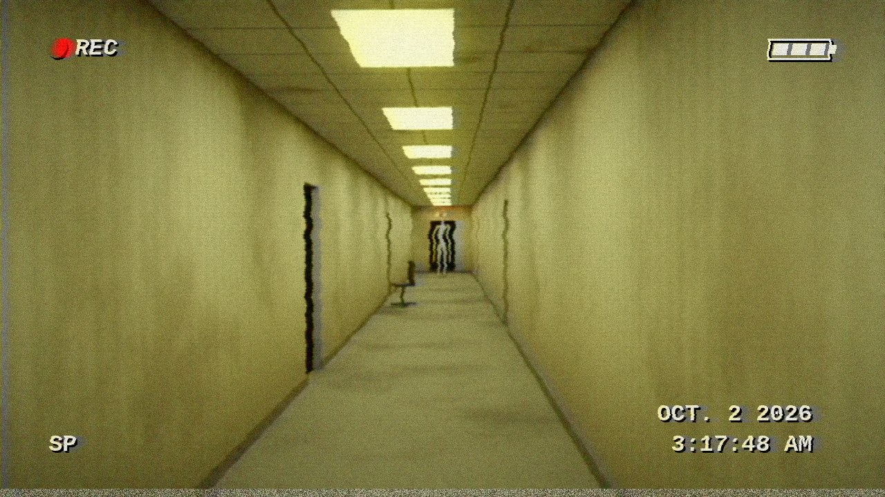
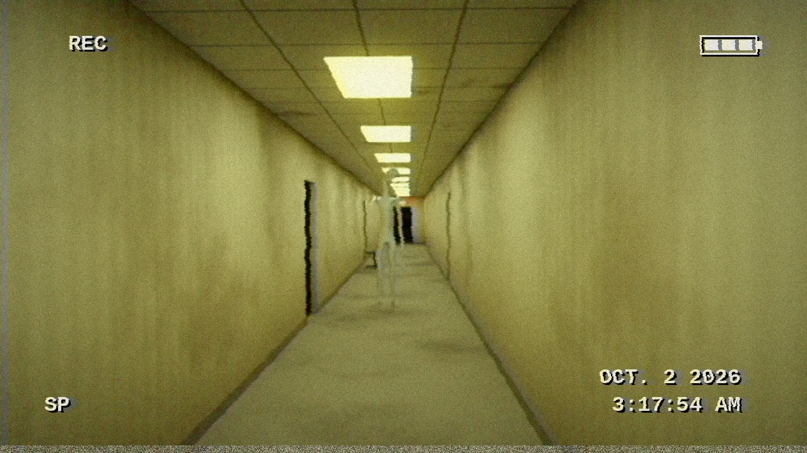
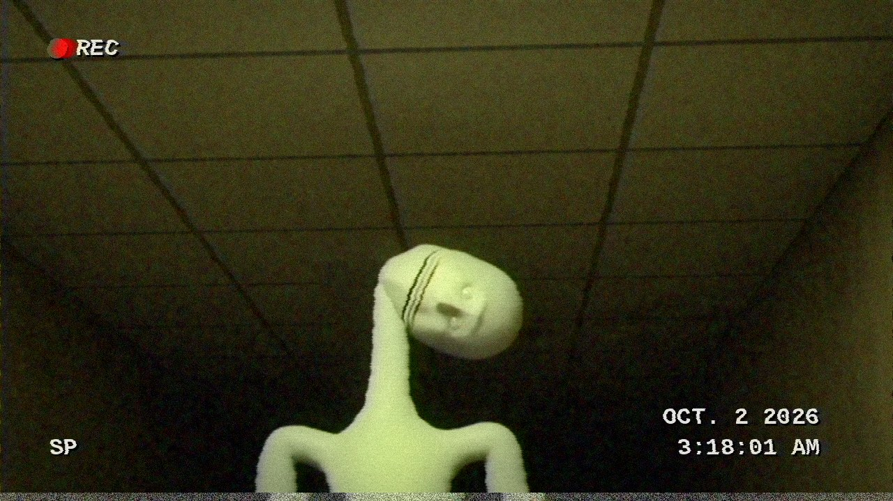
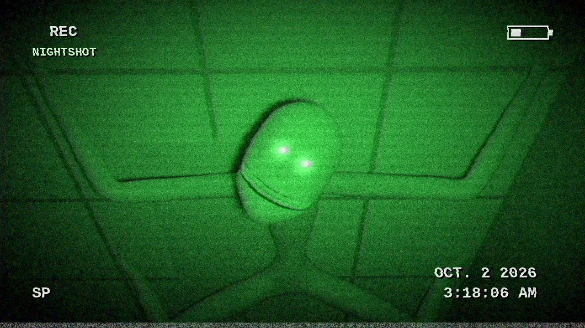

# THE HALLWAY

> *Recovered camcorder tape. OCT. 2 2026, 3:17 AM.*

**▶ [`the_hallway.mp4`](the_hallway.mp4)** · 30 seconds · sound on · lights off

A 30-second found-footage horror short where every part (the corridor, the
fluorescent lights, the thing at the end of the hall, its teeth, the sound,
the tape damage) is generated from Python. No models, textures, samples or
stock footage. Just Blender, numpy and bad intentions.

| | |
|---|---|
|  |  |
|  |  |

## What happens (spoilers)

1. An empty, yellow, humming office corridor. One tube at the far end sputters.
2. When it comes back on, something pale is standing under the EXIT sign.
3. Every time the lights cut out, it is closer. It never moves while you can see it.
4. It stops a couple of metres away. The hum stops with it. Then it starts to **smile**,
   all the way round to where its ears should be, with 134 teeth, while
   its head goes over sideways one cracking notch at a time. The lights behind
   it die one by one with a breaker clunk.
5. Blackout. The camcorder flips to NIGHTSHOT. The hallway is empty.
6. The operator looks up.

## How it's made

| file | does |
|---|---|
| `timeline.py` | Single source of truth: every flicker, blackout, crack and clunk, by frame. Picture, sound and post all read it. |
| `build_scene.py` | Builds the whole scene in Blender (`bpy`) and renders it with Cycles. |
| `soundtrack.py` | Synthesises the audio with numpy/scipy: 60 Hz ballast hum that follows the lights, relay ticks, breaker clunks, bone cracks, tinnitus, heartbeat, breathing, the sting. |
| `post.py` | Makes clean renders look like a dying camcorder tape (OSD, chroma bleed, tracking tears, head-switching noise, night-shot with eyeshine), then muxes with ffmpeg. |
| `make_tape.sh` | Runs the lot. ~90 min on 4 CPU cores. |
| `hallway.blend` | The generated scene, if you want to scrub through it in Blender 5. |

Some of the tricks:

- **The figure** is a stick skeleton of ~60 joints run through a Skin
  modifier, then subdivided and lightly displaced. Arms that reach past the
  knees and 20 cm fingers. Seven poses, one per appearance, swapped while the
  lights are off.
- **The face** is a UV sphere sculpted in code. Brow, almond sockets, lids,
  cheekbones, hollow cheeks, a nose, a chin, no ears, all bumps in "face
  coordinates". Eyes have a procedural iris and a Damped Track on the camera,
  so they never stop looking at you.
- **The grin** is a thin curved tube that hugs the face (placed by ray-casting
  against the head), Boolean-subtracted from it. Shape keys widen the tube, so
  the mouth unzips round the face towards the ears and reveals a ring of teeth
  that were hiding inside the head all along.
- **The lights**: each panel is its own emissive material plus an area lamp,
  keyed per frame from `timeline.light_level()`. Flicker is literal.
- **The ceiling**: in night-shot it was above you for the whole shot. Its legs
  are posed just past the top of frame.

## Rebuild it

```sh
pip install bpy==5.0.1 numpy scipy pillow     # bpy wants Python 3.11; also needs ffmpeg
./uncanny/make_tape.sh
```

Or poke at single frames:

```sh
python3 uncanny/build_scene.py --still 465 grin.png
python3 uncanny/build_scene.py --blend hallway.blend
```

*(It ends on a nod to the main game. Minority Panic eliminates the smallest group, after all.)*
